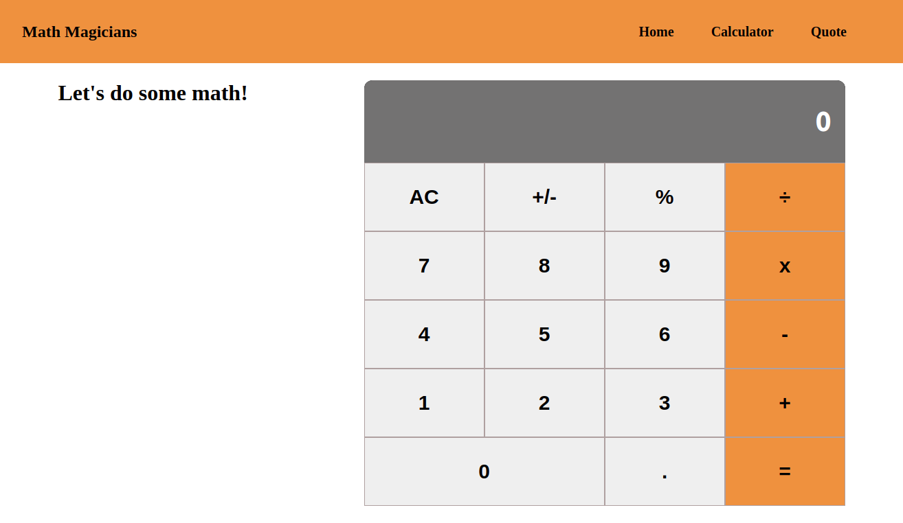

# Calculator 

> Calculator web-app built using ReactJS. The main goal for this project was to build a calculator app with a very basic function of calculations like Addition, Subtraction, Multiplication, Division, and Percentage Calculation for Math-magicians Inc. This project requires to use of class-based components and proper use of props and state management.

### You can access a Live Demo [HERE](https://calculator-react-app-v1.herokuapp.com/)

## Built With

- React
- JSX
- Webpack
- HTML5
- CSS3

## Getting Started

To get a local copy up and running follow these simple steps.

- [ ] Open your terminal
- [ ]  Navigate to the directory where you will like to install the repo by running `cd FOLDER-NAME` 
- [ ] Clone this repository
 > `git clone https://github.com/Div685/React-Calculator-app.git`
- [ ] run `npm install`
- [ ] run `npm start`
- [ ] The `npm start` command will redirect to your default browser, and in case it doesn't redirect automatically you can go to your favorite browser and run `http://localhost:3000/`.

 
## Authors

👤 **Divyesh Patel**

- GitHub: [@Div685](https://github.com/Div685)
- Twitter: [@div_685](https://twitter.com/div_685)
- LinkedIn: [Divyesh Patel](https://www.linkedin.com/in/divyesh-daxa-patel/)

## 🤝 Contributing

Contributions, issues, and feature requests are welcome!

Feel free to check the [issues page](https://github.com/Div685/React-Calculator-app/issues).

## Show your support

Give a ⭐️ if you like this project!